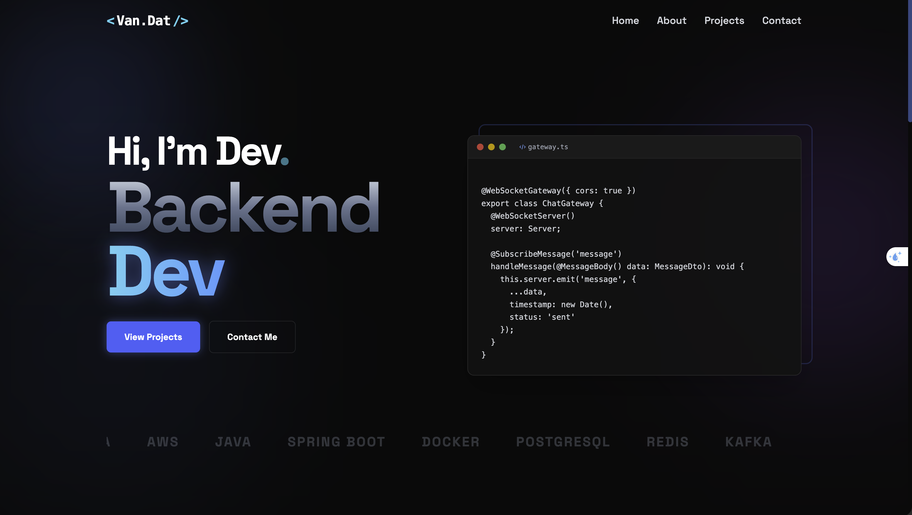
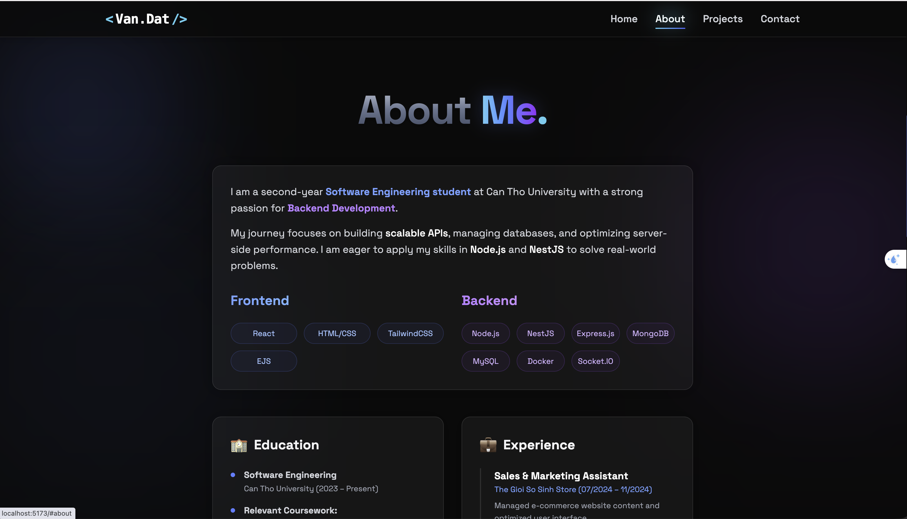
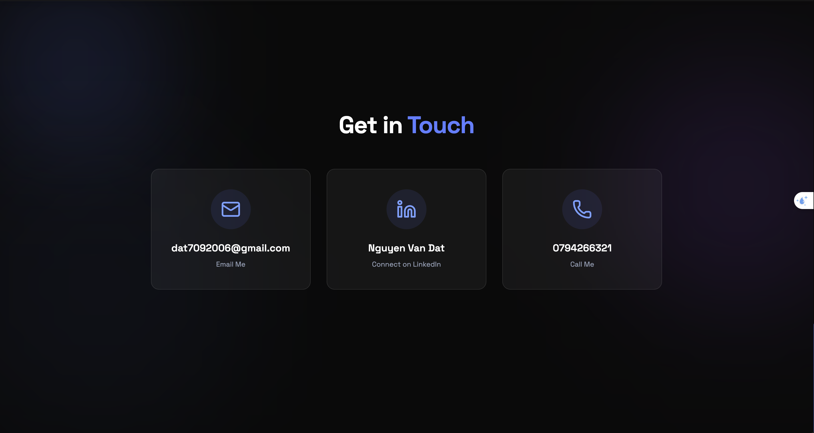

# <Van.Dat /> | Backend Developer Portfolio


Hi there! 👋 I'm **Nguyen Van Dat**, a passionate 2nd-year Software Engineering student at Can Tho University. This is my personal portfolio website, designed to showcase my journey, skills, and projects in Backend Development.

The site features a **Modern Dark UI** with **Glassmorphism** effects, ensuring a premium and smooth user experience.

## 🚀 Live Demo

👉 **Visit my Portfolio here:** [https://my-portfolio-beta-sable-16.vercel.app](https://my-portfolio-beta-sable-16.vercel.app)

_(e.g., https://my-portfolio.vercel.app)_

## 📸 Screenshots

|                   **Home Section**                   |                        **About Me**                        |
| :--------------------------------------------------: | :--------------------------------------------------------: |
|  |  |

|                 **Featured Projects**                 |                     **Contact**                      |
| :---------------------------------------------------: | :--------------------------------------------------: |
|  |  |

_> Note: Replace the image paths above with your actual screenshots._

## 🌟 Key Features

- **🎨 Modern Aesthetics:** Deep dark theme with ambient gradient glows and glassmorphism cards.
- **📱 Fully Responsive:** Optimized for both desktop and mobile devices.
- **⚡ High Performance:** Built with Vite for lightning-fast loading.
- **🎬 Smooth Animations:** Seamless transitions and hover effects using CSS and Tailwind.
- **📞 Interactive Contact:** Direct links to Phone, Email, and LinkedIn.

## 🛠 Tech Stack

- **Frontend:** React.js, TypeScript (optional if you used TS)
- **Build Tool:** Vite
- **Styling:** Tailwind CSS
- **Icons:** Lucide React / React Icons
- **Deployment:** Vercel

## 📂 Featured Projects

Here are some of the key projects highlighted in this portfolio:

1.  **NestChat** - A scalable Realtime Messaging Infrastructure (NestJS, MongoDB, Socket.IO, Redis).
2.  **LaptopShop** - Full-stack E-Commerce platform (Node.js, Express, MySQL, Prisma).

## 🏃‍♂️ Run Locally

Clone the project and run it locally on your machine:

```bash
# 1. Clone the repository
git clone [https://github.com/datb2404981/my-portfolio.git](https://github.com/datb2404981/my-portfolio.git)

# 2. Navigate into the directory
cd my-portfolio

# 3. Install dependencies
npm install

# 4. Start the development server
npm run dev
```

📬 Contact Me
I am currently open to Internship opportunities in Backend Development.
Phone: 0794266321
Email: dat7092006@gmail.com
LinkedIn: [Nguyen Van Dat](https://www.linkedin.com/in/nguyen-van-dat-nguyễn-9280ab377)
